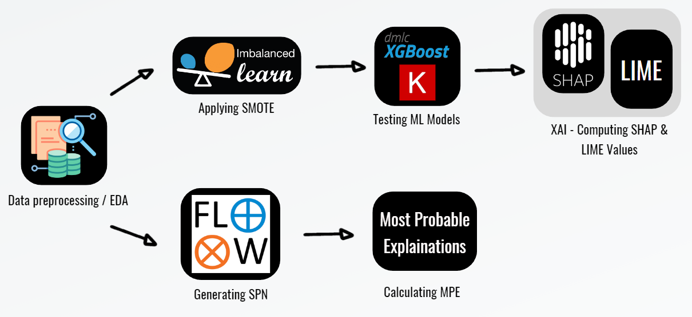
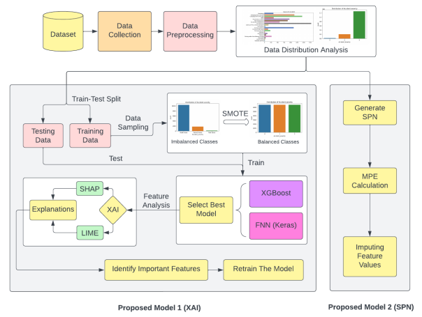

# Road Safety Prediction Model

## Introduction

Road accidents pose a significant global challenge, prompting extensive measures worldwide to reduce fatalities and injuries. Despite these efforts, understanding the complex nature of traffic incidents remains crucial for effective prevention strategies.

This research project explores the creation of predictive models for road accident severity using machine learning (ML) techniques. By analyzing diverse datasets, including the Road Accident (United Kingdom 2000-2018) Dataset, Road Traffic Accident Dataset of Addis Ababa City, and US Traffic Accident Dataset (2016 - 2023), we aim to identify the contributing factors and develop accurate models for severity prediction.

To enhance model interpretability, we integrate explainable artificial intelligence (XAI) approaches, such as Shapley Additive Explanations (SHAP) and Local Interpretable Model-agnostic Explanation (LIME). These techniques enable a deeper understanding of model predictions, facilitating the implementation of effective safety measures.

We have also utilized Sum-Product Networks (SPNs) to analyze patterns within the dataset and impute missing values for predictive analysis. Additionally, we employed Causal Inference techniques to identify causal relationships between dataset features.

## Objectives

The primary objectives of this study are as follows:

1. To conduct a thorough analysis of the variables that contribute to traffic accidents and how they affect the severity of injuries.
2. To develop predictive models for road accident severity using machine learning (ML) techniques, including Sum-Product Networks (SPNs).
3. To utilize explainable AI (XAI) methods to understand the prediction models and determine the importance of contributing components, such as Shapley Additive Explanations (SHAP) and Local Interpretable Model-agnostic Explanation (LIME).

## Contribution

This research makes several contributions to the field of road safety analysis and accident prevention:

1. Evaluation of multiple ML models, including Sum-Product Networks (SPNs), for predicting road accident severity.
2. Utilization of XAI methods to analyze predictive models and determine the significance of contributing variables.
3. The use of several datasets to analyze the correlations between accident severities and contributory factors in traffic accidents.
4. Provision of a systematic framework for analyzing road accidents and identifying effective safety measures.

## Proposed Algorithm

The proposed algorithm aims to revolutionize accident severity classification in road safety modeling. By leveraging advanced machine learning techniques, our primary goal is to enhance the accuracy of predicting accident severity levels. This includes accurately distinguishing between minor, serious, and fatal accidents based on various contributing factors.

The steps of the algorithm and the libraries used are depicted in the figure below.

### Architecture Diagram

The proposed framework is divided into two parts as follows:
1. Implementation of XAI techniques.
2. Implementation of SPN.

## Directories' Description

- `/data`: Contains the datasets used for model training and evaluation.
- `/models`: Stores trained machine learning models.
- `/notebooks`: Jupyter notebooks for data analysis, model training, and evaluation.

## Key Features and Requirements

- **Key Features**: 
  - Predictive modeling for road accident severity.
  - Utilization of machine learning algorithms and XAI techniques.
  - Evaluation of multiple datasets.
- **Requirements**:
  - Python 3.x
  - Jupyter Notebook
  - Pandas, NumPy, Scikit-learn, SHAP, LIME, SPFlow
  
## Links to Resources

- [SHAP GitHub Repository](link)
- [LIME GitHub Repository](link)
- [SPFlow GitHub Repository](link)

## Dataset Links

- [Road Accident (United Kingdom 2000-2018) Dataset](https://www.kaggle.com/datasets/devansodariya/road-accident-united-kingdom-uk-dataset)
- [Road Traffic Accident Dataset of Addis Ababa City](https://www.kaggle.com/datasets/saurabhshahane/road-traffic-accidents)
- [US Traffic Accident Dataset (2016 - 2023)](https://www.kaggle.com/datasets/sobhanmoosavi/us-accidents)

## Thank You

Special thanks to my mentors for their guidance and support throughout this project.
